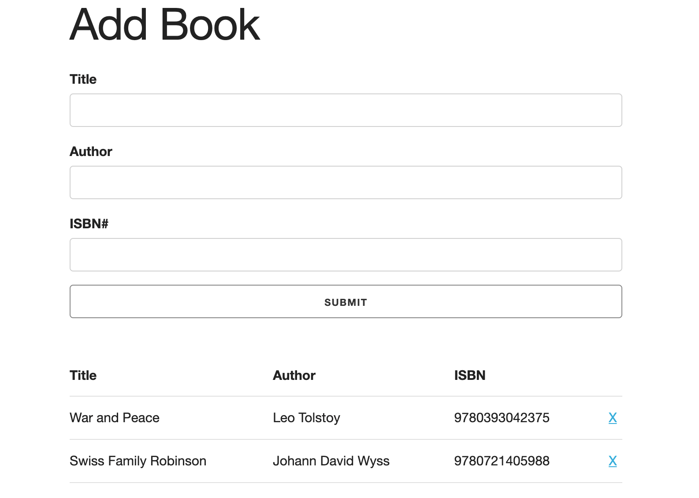

# _Book List_

#### This project is a browser-based book list application that allows you to keep track of

#### _06/2021_

#### By _**Chris Korsak**_

## Description

This book list application is a project from [Modern Javascript From The Beginning](https://www.udemy.com/course/modern-javascript-from-the-beginning) on Udemy. The application was written in two syntax styles. app.js uses Javascript ES5 object prototype syntax, and appes6.js uses ES6 class syntax, for a cleaner, more organized file. This application incorporates DOM manipulation, and also uses browser local storage to persist data.

Additionally, this application uses a CSS boilerplate framework called [Skeleton](http://getskeleton.com/) to create the user interface. This application is fully responsive to all screen sizes.

## Features

* Add a book (title, author, isbn)
* Delete a book
* Alert dialog box appears after adding book, deleting book, or incorrect user input
* Application persists data to browser local storage

## Setup/Installation Requirements

None. This is a web-based application hosted on Github pages. Check out the app [here!](https://chriskorsak.github.io/booklist/)

## Technologies Used

* HTML
* CSS (Skeleton framework)
* Javascript (including local storage)